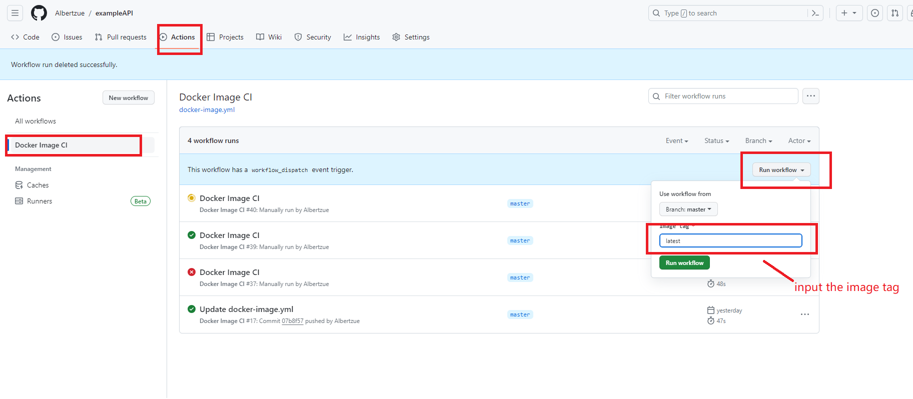

# exampleAPI

when the pipeline run successfully, use **kubectl port-forward -n exampleapi service/exampleapi-service 8082:80**
then input the url  **http://localhost:8082/swagger/index.html** to check the result
